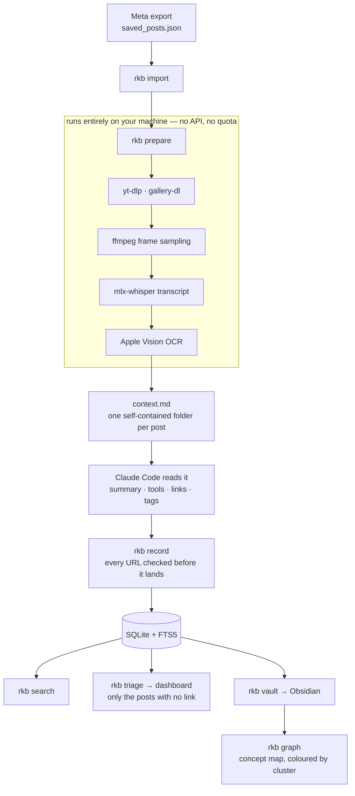

# Reels To Knowledge Base

Saved Instagram reels and carousels → a searchable knowledge base you can act on,
readable as an Obsidian vault.

**The problem:** the useful part of a tech reel is usually a GitHub URL flashed on
a title card for one second and never spoken, or a checklist that exists only as
pixels. Transcription alone loses all of it. One reel in this library ends with
*"comment memory and I'll send you the repo link"* — the link is deliberately
withheld from the audio, and sits on screen the whole time.

So every post gets a transcript **and** OCR of every frame or slide, and
extraction reads them together.



The split in the middle is deliberate: everything up to `context.md` is local and
free, and extraction is a person driving an agent over a folder they can read.
There is no LLM call anywhere in `rkb/`.

---

## Requirements

| | | |
|---|---|---|
| macOS | Apple Silicon | OCR uses the system Vision framework; transcription uses MLX |
| Python | 3.11+ | 3.11 recommended (`.venv`) |
| ffmpeg | any recent | frame sampling and audio extraction |
| yt-dlp | recent | reels (video) |
| gallery-dl | recent | carousels (image posts) |
| Obsidian | 1.9+ | optional — reading the vault and the `.base` review queue |

The Apple Vision and MLX dependencies are the only macOS-specific parts. On
Linux you'd swap `rkb/ocr.py` for tesseract and `rkb/transcribe.py` for
faster-whisper; nothing else changes.

## Install

```bash
git clone https://github.com/Manas-Taneja/ReelsToKnowledgeGraph.git
cd ReelsToKnowledgeGraph

brew install ffmpeg yt-dlp gallery-dl
python3.11 -m venv .venv
.venv/bin/pip install -r requirements.txt

./bin/rkb init
```

`bin/rkb` is a shim that runs the venv's Python directly, so you never need to
activate anything.

`requirements.txt`:

```
mlx-whisper                 # local transcription on the GPU
pyobjc-framework-Vision     # on-device OCR
pyobjc-framework-Quartz     # image loading for Vision
```

## Use

**1. Export your saved posts.** Instagram → Accounts Center → Your information
and permissions → Export your information → *Saved items*, as **JSON**. Unzip
into `data/export/`.

**2. Import.**

```bash
./bin/rkb import
./bin/rkb import --exclude food,adhd     # collections you never want
./bin/rkb collections                    # counts per collection
```

Pulls every post out of the export with its caption, hashtags, creator, and
which of **your own Instagram collections** it was filed in. Exclusions persist
in `data/excluded_collections.txt`, so re-imports never resurrect them.

**3. Prepare.** Downloads, samples frames, transcribes, and OCRs.

```bash
./bin/rkb prepare -n 25
./bin/rkb prepare -n 25 --retry          # also retry previous failures
./bin/rkb prepare -n 25 --kind reel      # only reels, or --kind post
```

Runs entirely locally — no API, no quota. Failures are recorded per-post and
never abort the batch.

**4. Extract.** Ask Claude Code to process the batch. It reads each post's
`context.md` and writes results back via `./bin/rkb record`. See `CLAUDE.md` for
the instructions it follows.

**5. Render and review.**

```bash
./bin/rkb vault                          # write the Obsidian vault
./bin/rkb triage                         # what has a payload, what needs you
./bin/rkb dashboard --serve              # review queue; every click saves
./bin/rkb search "rag"                   # FTS5 search from the terminal
```

---

## Documentation

| | |
|---|---|
| **[The pipeline](docs/pipeline.md)** | What happens between saving a post and reading it: frame sampling, OCR, link verification, triage, and what a full pass costs |
| **[The Obsidian vault](docs/vault.md)** | The notes, the two flat tables, and how the concept graph is thinned from 341 nodes to something readable |
| **[Reference](docs/reference.md)** | Every environment variable, the database schema, the module layout |
| **[Cookies](docs/cookies.md)** | Why image and carousel posts need a login, and how to give them one safely |

---

## Contributing

Setup, the extraction contract, and what the code expects of a change are in
[CONTRIBUTING.md](CONTRIBUTING.md). Security-relevant behaviour — cookies, the
local dashboard server, what leaves your machine — is in
[SECURITY.md](SECURITY.md).

## A note on Instagram

This downloads media you have already saved to your own account, using either
anonymous access or your own session. Bulk-fetching with your cookies is against
Instagram's terms and is what gets accounts restricted, which is why cookies are
opt-in, `prepare` throttles on purpose, and neither is something to work around.
Downloaded posts remain the property of the people who made them; this builds a
private index of what you saved, not a redistribution of it.

## License

[Apache License 2.0](LICENSE) — permissive, with an explicit patent grant.
Copyright 2026 Manas Taneja.
