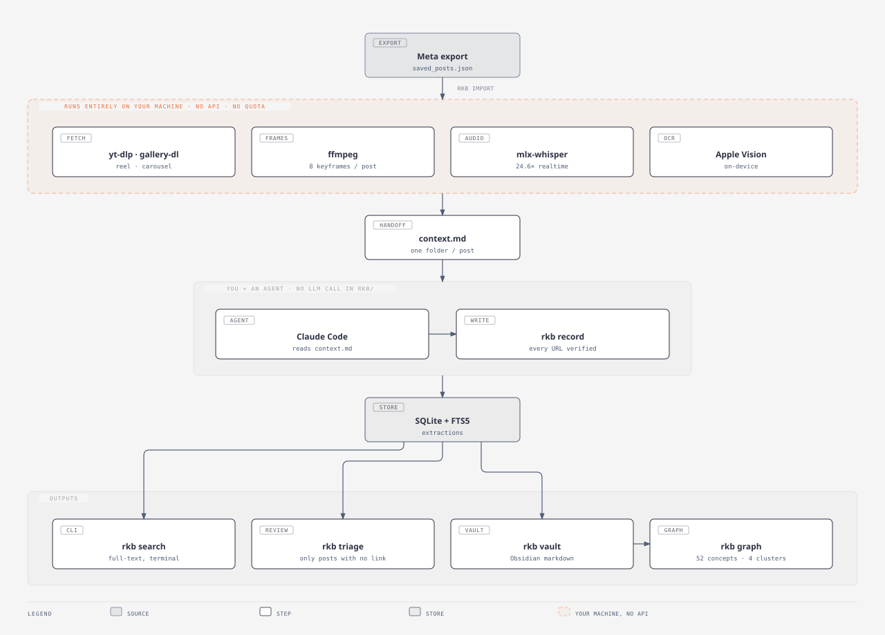
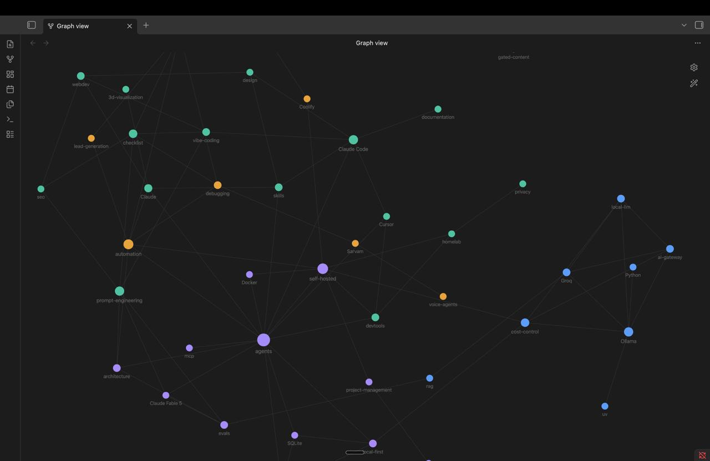
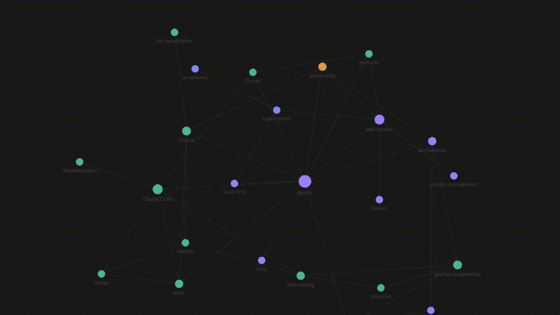
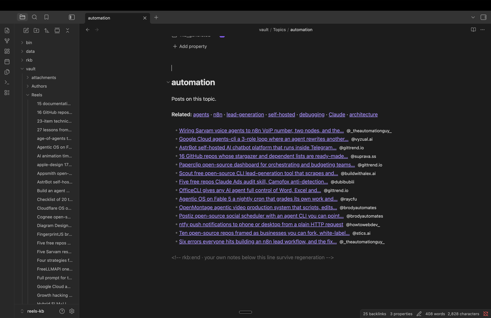

# Reels To Knowledge Base

Saved Instagram reels and carousels, and saved X posts → a searchable knowledge
base you can act on, readable as an Obsidian vault.

**The problem:** the useful part of a tech reel is usually a GitHub URL flashed on
a title card for one second and never spoken, or a checklist that exists only as
pixels. Transcription alone loses all of it. One reel in this library ends with
*"comment memory and I'll send you the repo link"* — the link is deliberately
withheld from the audio, and sits on screen the whole time.

So every post gets a transcript **and** OCR of every frame or slide, and
extraction reads them together.

<picture>
  <source media="(prefers-color-scheme: dark)" srcset="docs/assets/pipeline-dark.svg">
  
</picture>

The dashed boundary is the point: everything up to `context.md` runs on your
machine with no API and no quota, and extraction is a person driving an agent
over a folder they can read. There is no LLM call anywhere in `rkb/`.

---

## What you end up with

<picture></picture>

Every tool and topic that connects two or more posts becomes a hub note, and the
hubs link to each other by co-occurrence. Nothing here was filed by hand.



The layout is force-directed, so the clusters above are not a drawing — they are
where the nodes come to rest once every co-occurrence edge is pulling at once.

<picture></picture>

Open one and you get every post that touched it, strongest associations first —
which is the answer to *"there's no relation among each reel"*.

---

## Requirements

| | | |
|---|---|---|
| macOS | Apple Silicon | OCR uses the system Vision framework; transcription uses MLX |
| Python | 3.11+ | 3.11 recommended (`.venv`) |
| ffmpeg | any recent | frame sampling and audio extraction |
| yt-dlp | recent | reels (video) |
| gallery-dl | recent | carousels, and everything on X including the bookmark feed |
| Obsidian | 1.9+ | optional — reading the vault and the `.base` review queue |

The Apple Vision and MLX dependencies are the only macOS-specific parts. On
Linux you'd swap `rkb/ocr.py` for tesseract and `rkb/transcribe.py` for
faster-whisper; nothing else changes.

## Install

```bash
git clone https://github.com/Manas-Taneja/ReelsToKnowledgeGraph.git
cd ReelsToKnowledgeGraph

brew install ffmpeg yt-dlp gallery-dl
python3.11 -m venv .venv
.venv/bin/pip install -r requirements.txt

./bin/rkb init
```

`bin/rkb` is a shim that runs the venv's Python directly, so you never need to
activate anything.

`requirements.txt`:

```
mlx-whisper                 # local transcription on the GPU
pyobjc-framework-Vision     # on-device OCR
pyobjc-framework-Quartz     # image loading for Vision
```

## Use

**1. Get your saved posts in.** Three doors, all landing in the same table at
status `new`.

*Instagram, in bulk.* Instagram → Accounts Center → Your information and
permissions → Export your information → *Saved items*, as **JSON**. Unzip into
`data/export/`, then:

```bash
./bin/rkb import
./bin/rkb import --exclude food,adhd     # collections you never want
./bin/rkb collections                    # counts per collection
```

Pulls every post out of the export with its caption, hashtags, creator, and
which of **your own Instagram collections** it was filed in. Exclusions persist
in `data/excluded_collections.txt`, so re-imports never resurrect them.

*X, in bulk.* No export to request — the bookmark feed is live:

```bash
./bin/rkb bookmarks                      # needs cookies; see docs/cookies.md
```

*One link, either platform.* No export at all:

```bash
./bin/rkb add https://www.instagram.com/reel/Dbm7X5IAuEe/
./bin/rkb add https://x.com/simonw/status/1839283746152938495
```

**2. Prepare.** Downloads, samples frames, transcribes, and OCRs.

```bash
./bin/rkb prepare -n 25
./bin/rkb prepare -n 25 --retry          # also retry previous failures
./bin/rkb prepare -n 25 --kind reel      # reel, post, or tweet
./bin/rkb prepare --platform twitter     # one source only
```

Runs entirely locally — no API, no quota. Failures are recorded per-post and
never abort the batch. Nothing before this step downloads anything: saving a
link costs milliseconds, preparing it costs a video download, ffmpeg, whisper
and OCR, so the two are deliberately separate acts.

A tweet with no picture or video is not a failed download — its text *is* the
post, so it gets no frames and no transcript and says so.

**3. Extract.** Ask Claude Code to process the batch. It reads each post's
`context.md` and writes results back via `./bin/rkb record`. See `CLAUDE.md` for
the instructions it follows.

**4. Render and review.**

```bash
./bin/rkb vault                          # write the Obsidian vault
./bin/rkb triage                         # what has a payload, what needs you
./bin/rkb dashboard --serve              # review queue; every click saves
./bin/rkb search "rag"                   # FTS5 search from the terminal
```

---

## From your phone

```bash
./bin/rkb telegram
```

Forward a post from the share sheet into your own Telegram bot and it lands in
the queue. Saving downloads nothing — the reply tells you how many posts are
waiting and carries a **⚡ Prepare N waiting** button. Tap it when you are back
at the machine, and that is when the downloading, transcription and OCR happen.

It is a bot rather than something your phone POSTs to because `getUpdates`
long-polls *outward*: no inbound port, no tunnel, no static IP, and it keeps
working when the laptop changes networks. Written against Telegram's HTTP API
over stdlib `urllib` — no library, so no new dependency and no licence to
reason about.

The allowlist defaults closed: anyone who finds a bot's username can message
it, and ingesting starts downloads on your machine. Setup is three steps in
[docs/telegram.md](docs/telegram.md).

There is also `./bin/rkb ingest --serve`, the same thing over HTTP, if you would
rather drive it from an iOS Shortcut and keep the traffic off a third party.

---

## Documentation

| | |
|---|---|
| **[The pipeline](docs/pipeline.md)** | What happens between saving a post and reading it: frame sampling, OCR, link verification, triage, and what a full pass costs |
| **[The Obsidian vault](docs/vault.md)** | The notes, the two flat tables, and how the concept graph is thinned from 341 nodes to something readable |
| **[Reference](docs/reference.md)** | Every environment variable, the database schema, the module layout |
| **[Cookies](docs/cookies.md)** | Why image and carousel posts need a login, and how to give them one safely |
| **[The Telegram front door](docs/telegram.md)** | Making the bot, the allowlist, and draining the queue from a button |

---

## Contributing

Setup, the extraction contract, and what the code expects of a change are in
[CONTRIBUTING.md](CONTRIBUTING.md). Security-relevant behaviour — cookies, the
local dashboard server, what leaves your machine — is in
[SECURITY.md](SECURITY.md).

## A note on Instagram and X

This downloads media you have already saved to your own account, using either
anonymous access or your own session. Bulk-fetching with your cookies is against
both platforms' terms and is what gets accounts restricted, which is why cookies
stay opt-in where they can (Instagram reels need none at all), `prepare`
throttles on purpose, and neither is something to work around. X is the stricter
case: it serves a logged-out client almost nothing, so its cookies are required
rather than optional — which is all the more reason to keep the volume low.
Downloaded posts remain the property of the people who made them; this builds a
private index of what you saved, not a redistribution of it.

## License

[Apache License 2.0](LICENSE) — permissive, with an explicit patent grant.
Copyright 2026 Manas Taneja.
